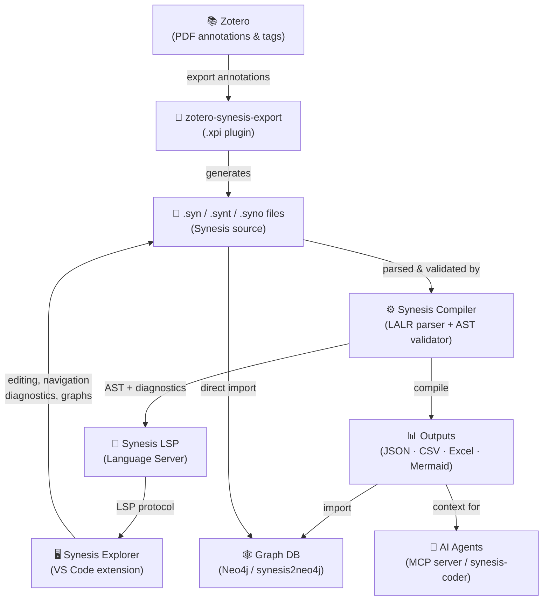
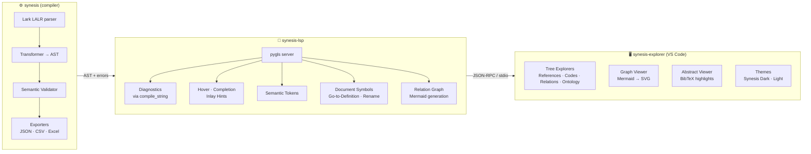

# Synesis

> **The confluence of information into intelligence.**

A Domain-Specific Language and toolchain for transforming qualitative research annotations into structured, auditable knowledge.

[](https://opensource.org/licenses/MIT)
[](https://www.python.org/downloads/)

---

## What is Synesis?

Qualitative research — literature reviews, grounded theory, case studies — generates enormous amounts of interpretive work that is typically lost in unstructured notes, spreadsheets, or proprietary software. Synesis is a **compiler for analytical thinking**: you write your interpretations in plain-text files with a clean declarative syntax, and the toolchain validates, structures, and exports them as canonical knowledge artifacts.

The result is true **σύνεσις** — the convergence of evidence fragments into an intelligible, auditable, and technically rigorous whole.

---

## The Ecosystem



---

## Components

| Component | Language | Description |
|---|---|---|
| [synesis](https://github.com/synesis-lang/synesis) | Python | Compiler, parser, validator, exporter |
| [synesis-lsp](https://github.com/synesis-lang/synesis-lsp) | Python | Language Server (LSP) — diagnostics, hover, completion |
| [synesis-explorer](https://github.com/synesis-lang/synesis-explorer) | TypeScript/JS | VS Code extension — editors, tree views, graph viewer |
| [zotero-synesis-export](https://github.com/synesis-lang/zotero-synesis-export) | JavaScript | Zotero 7 plugin — export PDF annotations to `.syn` |
| [synesis2neo4j](https://github.com/synesis-lang/synesis2neo4j) | Python | Import compiled knowledge graphs into Neo4j |
| [synesis-coder](https://github.com/synesis-lang/synesis-coder) | Python | AI coding assistant with Synesis context |

---

## Key Concepts

**Sources & Items** — You annotate bibliographic sources (`SOURCE @smith2023`) and individual data excerpts (`ITEM @smith2023_p12`). Every annotation is traceable to a BibTeX reference.

**Templates** — A `.synt` file defines the field schema for your project: which fields are `REQUIRED`, `OPTIONAL`, or `FORBIDDEN`, what types they accept (`CODE`, `TEXT`, `CHAIN`, `SCALE`...), and validation rules (`ARITY`, `BUNDLE`, `VALUES`).

**Ontologies** — A `.syno` file defines the controlled vocabulary of codes. The compiler validates every code against the ontology, catching typos and orphaned concepts at compile time.

**Chains** — Causal or relational connections between codes: `Trust -> ENABLES -> Acceptance`. Chains can be simple or qualified with typed relations, and are validated against the template's `ARITY` and `RELATIONS` constraints.

---

## Potential Applications

- **Systematic literature reviews** — annotate hundreds of papers with a shared template; export clean datasets for meta-analysis
- **Grounded Theory / Thematic Analysis** — build and validate code systems with ontological constraints; trace every code to its source
- **Mixed-methods research** — bridge qualitative interpretation with quantitative export formats (CSV, Excel, JSON) for integration with R or Python
- **Knowledge graphs** — compile research findings into Neo4j for visualization and query; model causal chains as graph edges
- **AI-augmented analysis** — feed structured annotations as context to LLMs; synesis-coder generates annotations from AI suggestions with human review
- **Longitudinal projects** — template versioning and strict validation prevent concept drift across research phases

---

## Quick Start

### 1. Install the compiler and LSP

```bash
pip install synesis synesis-lsp
```

### 2. Install the VS Code extension

Download `synesis-explorer-*.vsix` from [Releases](https://github.com/synesis-lang/synesis-explorer/releases) and install via:

```
Ctrl+Shift+P → Extensions: Install from VSIX...
```

### 3. Export from Zotero (optional)

Install `synesis-export.xpi` in Zotero 7. After annotating PDFs, use **File → Export Library → Synesis Format**.

### 4. Write your first annotation

```
# references.bib contains @smith2023

SOURCE @smith2023
    note: Examines trust dynamics in renewable energy adoption across 14 European countries.
    codes: Trust, Social_Acceptance, Governance
END SOURCE

ITEM @smith2023_p47
    text: "Community engagement emerged as the strongest predictor of project acceptance."
    codes: Community_Engagement, Social_Acceptance
    chain: Community_Engagement -> ENABLES -> Social_Acceptance
END ITEM
```

### 5. Compile

```bash
synesis compile project.synp --output results/
```

---

## Language at a Glance

```
# template.synt — define the field schema
TEMPLATE QualitativeStudy

SOURCE FIELDS
    FIELD note TYPE MEMO OPTIONAL
    FIELD codes TYPE CODE OPTIONAL SCOPE ONTOLOGY
END FIELDS

ITEM FIELDS
    FIELD text TYPE QUOTATION REQUIRED
    FIELD codes TYPE CODE REQUIRED SCOPE ONTOLOGY
        ARITY 1..5
    FIELD chain TYPE CHAIN OPTIONAL
        RELATIONS INFLUENCES, ENABLES, CONSTRAINS
    FIELD rgt_element_a TYPE TEXT OPTIONAL
        GUIDELINES
            Describe the positive/functional pole of a bipolar construct.
            E.g.: "High Trust" (not just "Trust")
        END GUIDELINES
END FIELDS

END TEMPLATE
```

---

## Architecture



---

## File Types

| Extension | Purpose |
|---|---|
| `.syn` | Annotation files — sources and items |
| `.synp` | Project file — declares template, bibliography, includes |
| `.synt` | Template file — field schema and validation rules |
| `.syno` | Ontology file — controlled vocabulary of codes |
| `.bib` | BibTeX bibliography (standard format) |

---

## License

MIT — see [LICENSE](LICENSE).
