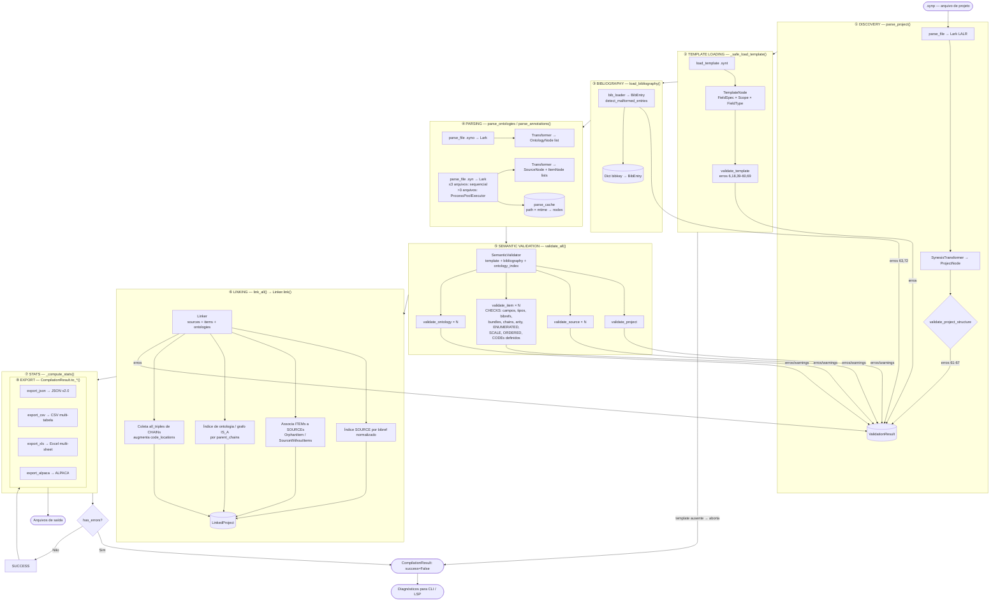
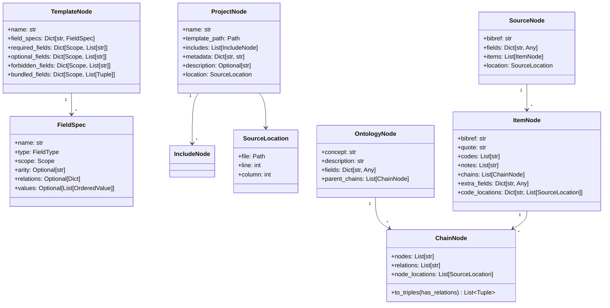
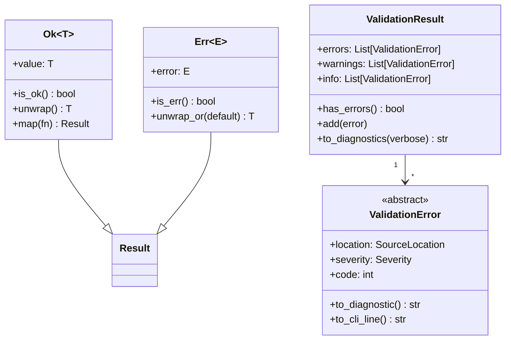
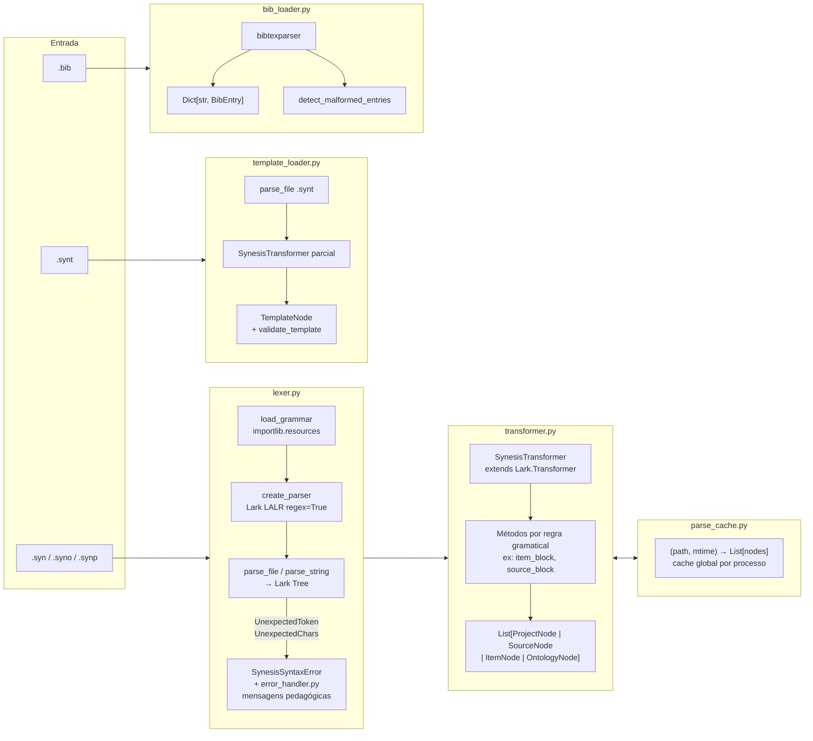
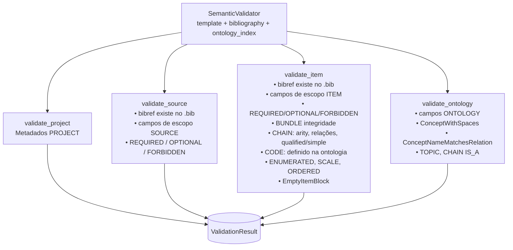
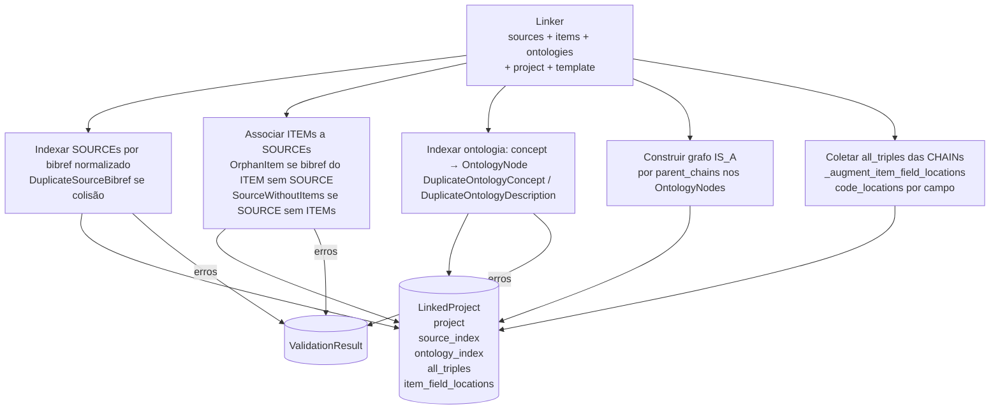
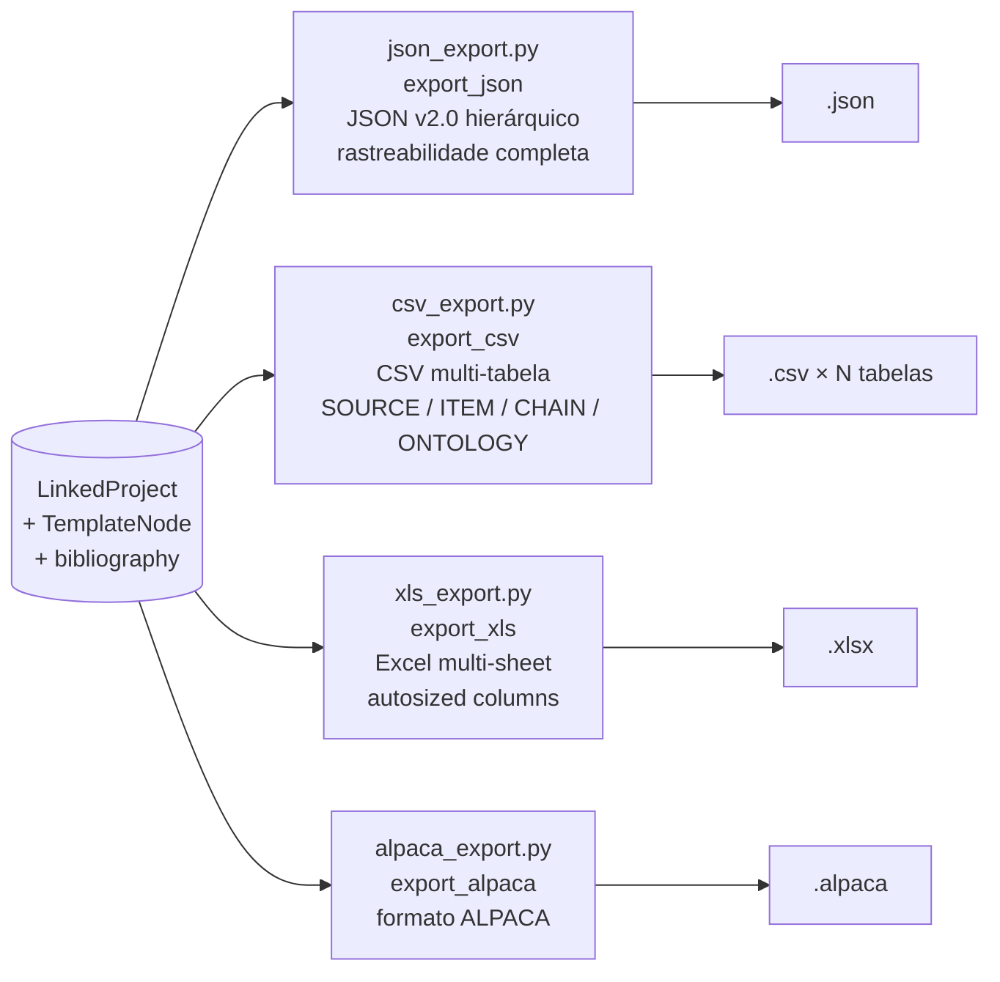
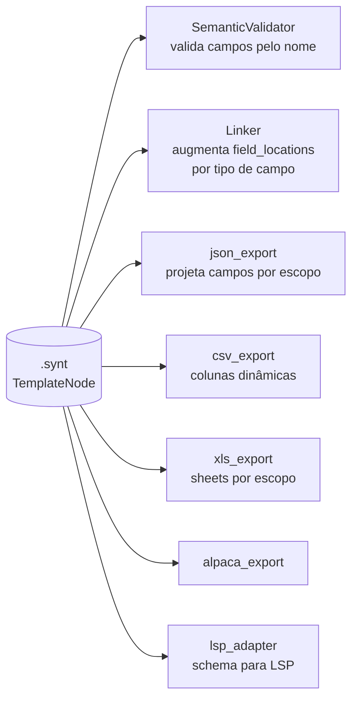
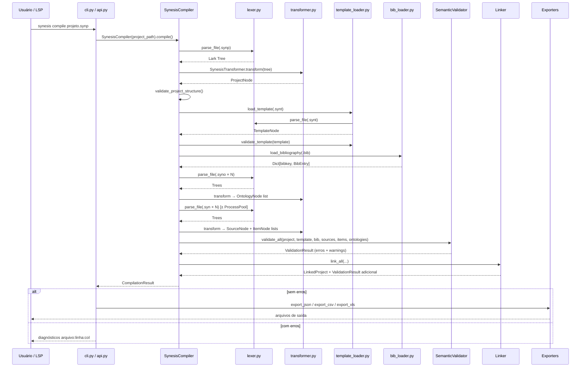

# Arquitetura do Compilador Synesis

> Última atualização: 2026-06-18 — baseada no código-fonte em `d:\GitHub\synesis\`

---

## 1. Visão Geral

O compilador Synesis transforma arquivos `.syn` (anotações), `.syno` (ontologia) e `.synt` (template) em saídas estruturadas (JSON, CSV, Excel, ALPACA). O orchestrador central é `SynesisCompiler` em `compiler.py`, que coordena oito estágios em sequência estrita. Erros em qualquer estágio são acumulados em `ValidationResult` e nunca lançam exceções não controladas para o chamador.

---

## 2. Estrutura de Módulos

```
synesis/
├── cli.py                   # Entrypoint CLI (Click)
├── api.py                   # API em-memória: synesis.load()
├── compiler.py              # SynesisCompiler — orquestrador
├── lsp_adapter.py           # Bridge para LSP (arquivo único)
├── error_handler.py         # Mensagens pedagógicas de erro
│
├── ast/
│   ├── nodes.py             # Dataclasses da AST (frozen não-aplicado, mas imutáveis por convenção)
│   ├── results.py           # Result[T,E], Ok/Err, ValidationResult, ValidationError
│   └── normalize.py         # normalize_code, normalize_bibref
│
├── parser/
│   ├── lexer.py             # Wrapper Lark LALR(1), SynesisSyntaxError
│   ├── transformer.py       # Parse tree → nós AST tipados
│   ├── template_loader.py   # Parsing .synt → TemplateNode
│   ├── bib_loader.py        # Parsing BibTeX → Dict[str, BibEntry]
│   └── parse_cache.py       # Cache (path, mtime) → List[nodes]
│
├── semantic/
│   ├── validator.py         # SemanticValidator: campos, tipos, bundles, bibrefs
│   └── linker.py            # Linker: vincula ITEMs a SOURCEs, constrói LinkedProject
│
├── exporters/
│   ├── json_export.py       # JSON hierárquico v2.0
│   ├── csv_export.py        # CSV multi-tabela
│   ├── xls_export.py        # Excel multi-sheet
│   ├── alpaca_export.py     # Formato ALPACA
│   └── _helpers.py          # Funções utilitárias compartilhadas
│
└── grammar/
    └── synesis.lark         # Gramática LALR(1) — CONGELADA para v1.x
```

---

## 3. Pipeline de Compilação

O método `SynesisCompiler.compile()` executa os estágios abaixo em ordem. Erros são **acumulados**, não interrompem o fluxo (exceto template ausente, que aborta cedo).



---

## 4. Nós da AST (`ast/nodes.py`)

Todos os nós são `@dataclass` e expõem `to_dict()` para serialização.



### Enums de domínio

| Enum | Valores |
|------|---------|
| `Scope` | `SOURCE`, `ITEM`, `ONTOLOGY` |
| `FieldType` | `QUOTATION`, `MEMO`, `CODE`, `CHAIN`, `TEXT`, `DATE`, `SCALE`, `ENUMERATED`, `ORDERED`, `TOPIC` |

---

## 5. Sistema de Erros (`ast/results.py`)



**Arquitetura dual de mensagens:**
- `to_diagnostic()` — mensagem verbosa, para LSP e LLMs (inclui contexto, sugestões)
- `to_cli_line()` — mensagem enxuta, para saída no terminal

---

## 6. Camada de Parser (`parser/`)



**Cache de parsing** (`parse_cache.py`): chave `(path.resolve(), mtime)` → `List[nodes]`. Beneficia compilações repetidas no mesmo processo (LSP, testes, API). A CLI não se beneficia (novo processo por invocação).

---

## 7. Validação Semântica (`semantic/validator.py`)

`SemanticValidator` recebe o `TemplateNode` como fonte da verdade e valida cada nó contra ele.



**Checagens notáveis em `validate_item`:**

| Verificação | Erro emitido |
|------------|--------------|
| Campo desconhecido | `UnknownFieldName` (com sugestão fuzzy) |
| Campo REQUIRED ausente | `MissingRequiredField` |
| Campo FORBIDDEN presente | `ForbiddenFieldPresent` |
| BUNDLE incompleto | `MissingBundleField` / `BundleCountMismatch` |
| CHAIN sem operador `->` | `ChainWithoutArrowOperator` |
| CHAIN qualificada malformada | `MalformedQualifiedChain` |
| ARITY violada | `ChainArityViolation` |
| CODE não definido na ontologia | `UndefinedCode` (warning) |
| Bibref não encontrado no .bib | `UnregisteredSource` |

---

## 8. Vinculação (`semantic/linker.py`)

`Linker` constrói o `LinkedProject` — estrutura consolidada para exportação.



---

## 9. Exportadores (`exporters/`)



**Regra de exportação:** exportação só ocorre quando `not has_errors()`. Com `--force` na CLI, a restrição é levantada.

---

## 10. Pontos de Integração

```mermaid
flowchart TD
    CLI["cli.py\nsynesis compile / check\nsynesis validate-template\nsynesis init"]
    API["api.py\nsynesis.load()\ncompile_string()\nMemoryCompilationResult"]
    LSP["lsp_adapter.py\nvalidate_single_file(path, content, ctx)\nDescobre .synp → carrega contexto\nCache por workspace + mtime"]

    CLI --> SC[SynesisCompiler]
    API --> SC
    LSP --> SV2[SemanticValidator\n+ parse_string\nsem disco]

    SC --> VR[(ValidationResult)]
    SV2 --> VR

    VR -->|CLI| TERM[Terminal\nfile:line:col: [SEVERITY] msg]
    VR -->|LSP| DIAG[LSP Diagnostics\nJSON-RPC → VSCode]
    VR -->|API| MEM[MemoryCompilationResult\nto_json_dict / to_csv_dict]
```

### Descoberta de contexto no LSP (`lsp_adapter.py`)

O `validate_single_file` opera em arquivo único mas tenta enriquecer a validação com o contexto do projeto:

1. Detecta raiz do workspace (marcadores: `.git`, `.vscode`, `.synp`)
2. Busca `.synp` na raiz
3. Carrega `TemplateNode` e `bibliography` a partir do `.synp`
4. Cache de contexto por workspace com invalidação por `mtime`

Sem `.synp` encontrado → emite warning, valida apenas sintaxe.

---

## 11. Paralelismo no Parsing de Anotações

```mermaid
flowchart TD
    PA[parse_annotations\nList[Path]]
    PA --> N{N arquivos}
    N -->|N ≤ 3| SEQ[Sequential\n_parse_annotations_sequential]
    N -->|N > 3| PAR[ProcessPoolExecutor\nmax_workers = min 4 N\n_parse_single_annotation por processo]
    SEQ & PAR --> RS[List[SourceNode]\n+ List[ItemNode]]
```

`_parse_single_annotation` é uma função module-level (necessário para pickling com `multiprocessing`). Cada worker cria seu próprio parser e transformer — não há estado compartilhado.

---

## 12. Template como Fonte da Verdade

O `TemplateNode` é carregado no estágio ② e propagado para todos os estágios seguintes. Nenhum componente assume nomes de campos fixos — a estrutura é sempre derivada do template em tempo de execução.



---

## 13. Gramática (`grammar/synesis.lark`)

Parser LALR(1) construído com Lark. Usa `regex=True` para suportar Unicode (`\p{L}`, `\p{N}`) em identificadores e valores.

**Status:** CONGELADA para v1.x. Alterações breaking requerem v2.0.

O arquivo `synesis_standalone.py` em `grammar/` é uma versão auto-contida do parser gerada para distribuição sem dependência de arquivo externo.

---

## 14. Fluxo Completo — Diagrama de Sequência


